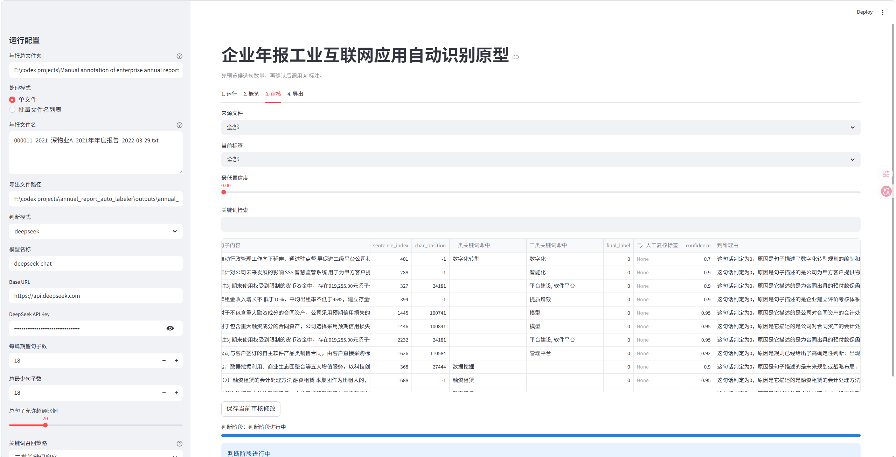

# 企业年报工业互联网应用自动识别工具

一个基于 `Streamlit` 的本地 Web 工具，用于从企业年报 `.txt` 文件中提取与“企业是否真正应用了工业互联网平台”相关的候选句，并完成 `0/1` 判断、人工复核与 Excel 导出。

这个项目面向课程作业和相似的文本筛选任务：先从年报里尽量找出相关句子，再判断这些句子是否表达了企业已经在自身业务流程中真实落地应用。它的定位不是“完全替代人工”，而是把最耗时的检索、初筛和初判环节自动化，让用户把时间用在最后一轮复核上。

按当前流程估算，处理约 `200` 句候选句时，调用 `DeepSeek API` 的成本大约在 `0.2` 元人民币左右，整轮处理时间通常在 `10` 分钟左右，适合快速反复试验与批量复核。

## 工具特点

- 支持批量读取企业年报 `.txt` 文件
- 支持 `utf-16`、`utf-8-sig`、`utf-8`、`gb18030`、`gbk` 自动识别，尽量减少乱码问题
- 先预览候选句，再确认后调用 AI 标注
- 支持一类关键词与二类关键词两层召回
- 支持规则判断与 `DeepSeek` 结合的 `0/1` 判定
- 支持人工审核、修改标签和导出 Excel
- 支持适当放宽召回，多生成一些句子后再人工筛选

## 核心思路

这不是简单的“全文关键词搜索”，而是一个分阶段流程：

1. 输入年报总文件夹与文件名列表
2. 自动读取并识别编码
3. 清洗文本、切分句子、过滤标题和明显碎片
4. 用一类/二类关键词召回候选句
5. 用规则先判明显的 `0` 或 `1`
6. 将边界句交给 `DeepSeek` 补判
7. 人工复核后导出结果

## 候选句如何抓取

候选句抓取分为四步：

1. 清洗文本  
去掉页码、目录、释义等噪声行，统一空白字符。

2. 切分句子  
优先按真正句末标点切分，并尽量合并被换行打断的长句。

3. 处理标题和碎片  
过滤明显标题、表格片段和残缺句，尽量保留完整正文。

4. 关键词召回  
先用一类关键词做基础召回，再用二类关键词做兜底召回。

## 一类与二类关键词

- 一类关键词：尽量贴合作业原始词典
- 二类关键词：更宽松的兜底词，用于提高召回率，避免某些年报完全抓不到句子

在界面里可以选择：

- `一类关键词`
- `二类关键词兜底`

如果你更在意数量，可以先用 `二类关键词兜底` 多生成一些句子，再在审核阶段人工筛掉泛化句。

## 关键词词典位置

关键词定义在：

- [report_labeler/keywords.py](./report_labeler/keywords.py)

其中：

- `PRIMARY_KEYWORDS_BY_CATEGORY`：一类关键词
- `SECONDARY_KEYWORDS_BY_CATEGORY`：二类关键词

如果觉得召回过宽或过窄，可以直接修改这里的词典后重新运行。

## 判断模式

### `mock`

- 不调用外部模型
- 仅依赖规则和启发式
- 适合调试流程或快速预览

### `deepseek`

- 调用 `DeepSeek API`
- 对边界句的语义判断更自然
- 会返回更接近人工标注风格的中文理由

## 页面功能

### 1. 运行

- 设置年报总文件夹
- 输入单个文件名或批量文件名
- 选择判断模式
- 设置每篇期望句子数、总最少句子数、允许超额比例、关键词召回策略

### 2. 概览

- 查看文档数、原始召回句数、最终候选句数、异常文件数
- 查看每篇年报的原始召回数、最终入选数、目标句数、编码和解码告警
- 用“年份 + 企业”方式展示统计结果

### 3. 审核

- 按来源文件、标签、置信度和关键词筛选
- 查看句子上下文
- 区分查看一类关键词命中与二类关键词命中
- 修改人工复核标签与备注

### 4. 导出

- 导出候选句预览表
- 导出 AI 标注后的提交简表与分析详表

## 前端界面

当前前端基于 `Streamlit`，采用“左侧参数配置 + 右侧分标签工作区”的布局：

- 左侧边栏负责输入路径、文件名、模型参数和召回配置
- 右侧主区域分为 `运行 / 概览 / 审核 / 导出`
- 审核页用于逐条查看句子、判断理由和关键词命中

审核页界面示意：



## 安装与运行

### 环境要求

- Python 3.11 或 3.12
- Windows 本地环境优先

### 安装依赖

```bash
pip install -r requirements.txt
```

### 启动应用

```bash
streamlit run app.py
```

启动后在浏览器打开：

```text
http://localhost:8501
```

## 使用示例

先填写年报总文件夹，例如：

```text
F:\codex projects\Manual annotation of enterprise annual reports\enterprise annual reports
```

再在“年报文件名”中输入：

单文件模式：

```text
600148_2019_长春一东_2019年年度报告_2020-04-28.txt
```

批量模式，一行一个：

```text
600148_2019_长春一东_2019年年度报告_2020-04-28.txt
832982_2024_锦波生物_2024年年度报告_2025-04-21.txt
000001_2023_平安银行_2023年年度报告_2024-03-15.txt
```

推荐流程：

1. 先选择 `二类关键词兜底`
2. 点击 `1. 先预览候选句`
3. 在概览页检查每篇年报的召回情况
4. 如果数量和分布都可以，再点击 `2. 确认后开始 AI 标注`
5. 在审核页人工筛掉不合适的句子
6. 在导出页输出 Excel

## 导出结果

### 候选句预览表

用于在 AI 标注前先检查候选句是否合理，包含：

- `句子内容`
- `来源文件`
- `显示名称`
- `id`
- `year`
- `一类关键词命中`
- `二类关键词命中`
- `规则标签提示`
- `规则判断理由`

### 提交简表

用于接近课程提交格式，包含：

- `句子内容`
- `来源文件`
- `人工标注标签`
- `id`
- `year`
- `判断理由`

### 分析详表

用于研究或复核，额外包含：

- 关键词命中
- 规则标记
- 上下文
- 置信度
- 模型来源
- 审核备注

## 目录结构

```text
annual_report_auto_labeler/
├─ app.py
├─ README.md
├─ requirements.txt
├─ report_labeler/
│  ├─ export.py
│  ├─ io_utils.py
│  ├─ keywords.py
│  ├─ llm.py
│  ├─ models.py
│  ├─ pipeline.py
│  ├─ preprocess.py
│  ├─ rules.py
│  ├─ ui.py
│  └─ __init__.py
└─ tests/
   └─ test_pipeline.py
```

## 已知限制

- 当前输入文件限定为 `.txt`
- 候选句质量仍受原始年报写法影响
- 二类关键词能提高召回，但也会引入更多边界句
- 工具适合高效初筛，不保证候选句全部高精度
- 最终结果仍建议用户人工复核与二次筛选
- `DeepSeek API` 需要用户自行提供 Key

## 说明

本项目定位为课程与研究场景下的辅助工具。它可以显著降低手工检索和初筛成本，但最终提交结果是否符合课程要求与学术规范，仍需由使用者自行确认。
